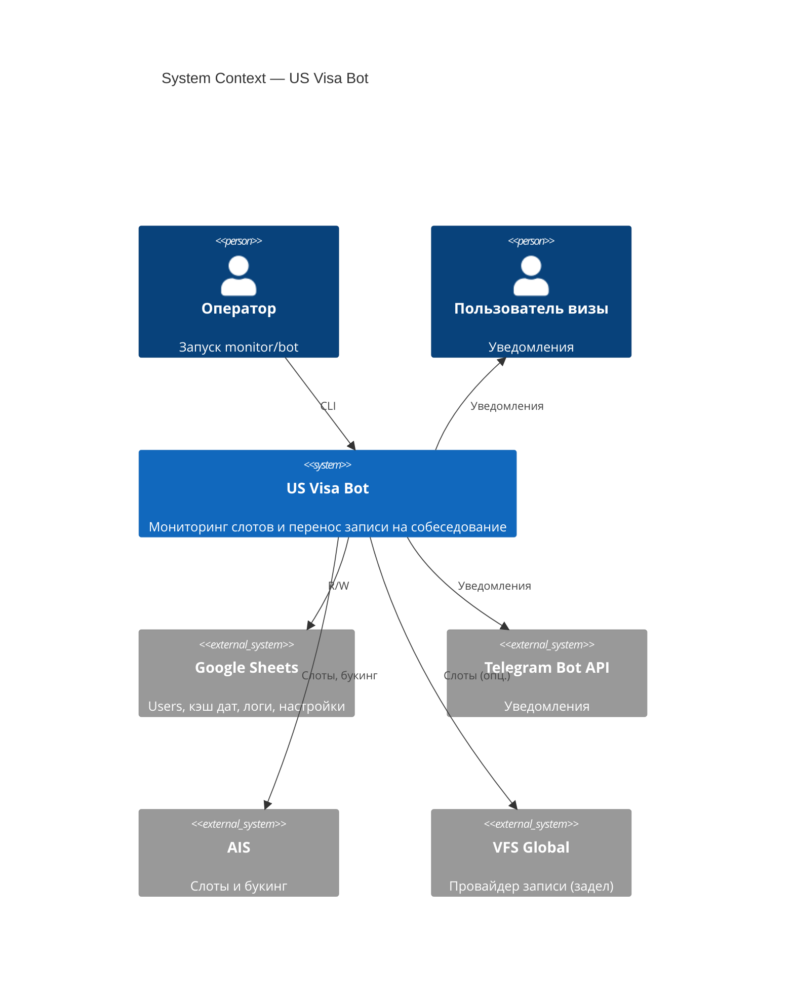
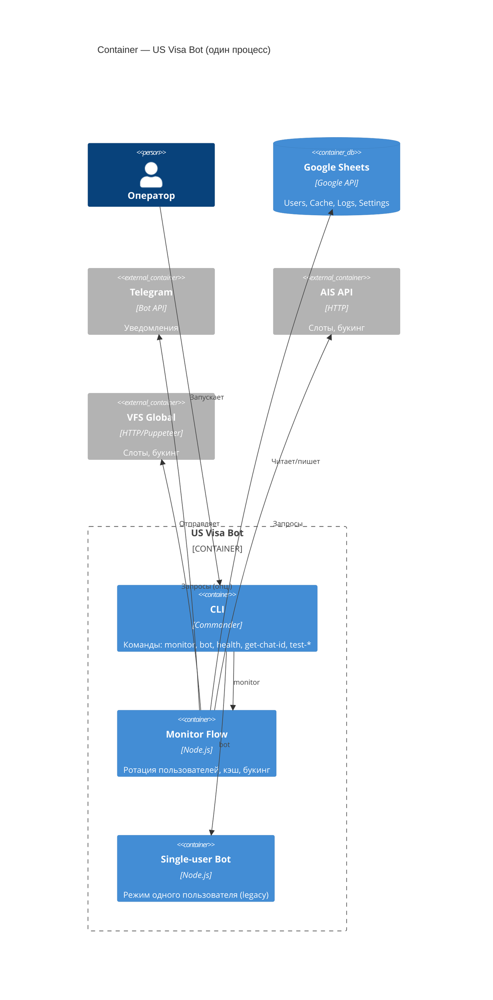
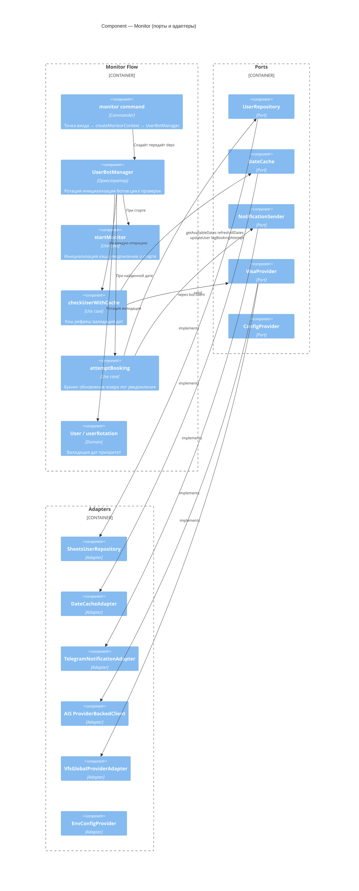
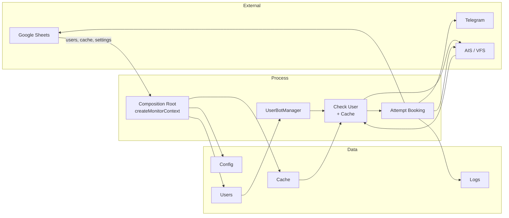
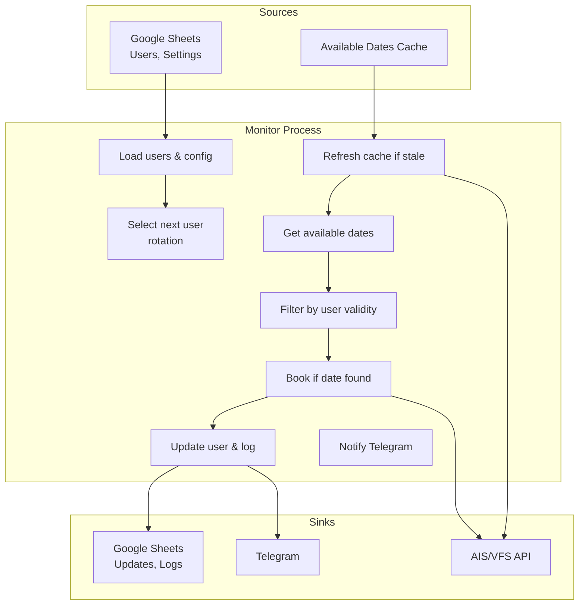
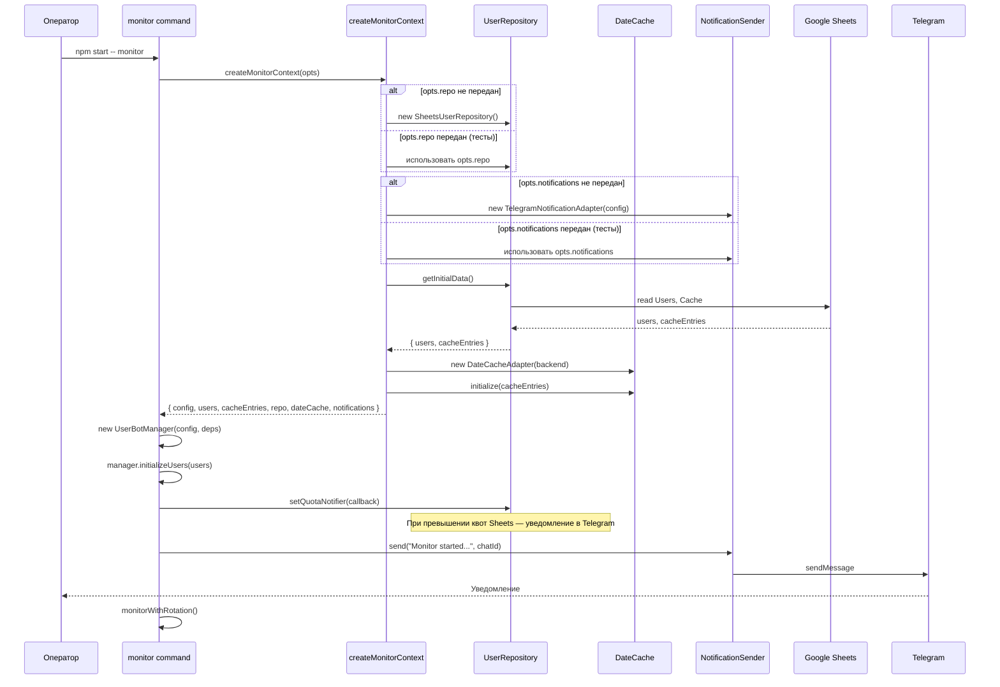
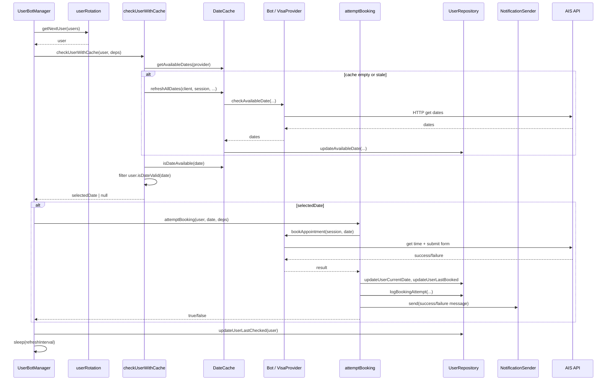
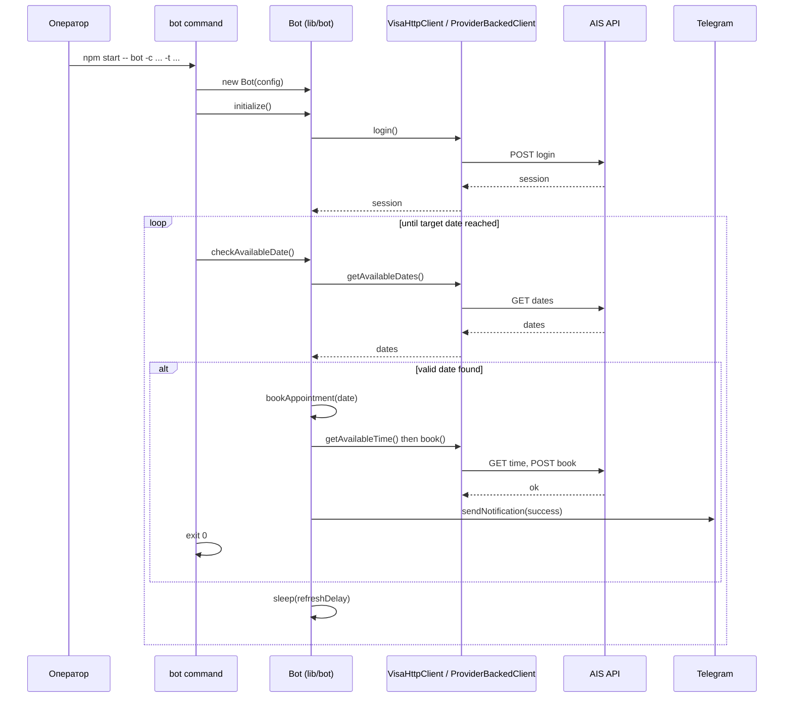

# Диаграммы системы

C4, DFD и sequence-диаграммы в формате Mermaid. Рендер: GitHub, GitLab, VS Code (Mermaid), или [mermaid.live](https://mermaid.live).

Связано: [ARCHITECTURE.md](ARCHITECTURE.md) · [CONTRACTS.md](CONTRACTS.md) · [ADR](adr/README.md).

**Актуальность:** диаграммы соответствуют текущей архитектуре: Node 18+, встроенный fetch; доступ к Google Sheets — через `lib/sheets.ts` (доменный API: Users, Cache, Logs, Settings) и `lib/sheetsClientCore.ts` (низкоуровневый get/batchGet/update/append + quota retry); уведомления о квотах через `repo.setQuotaNotifier()`; Telegram через `TelegramNotificationAdapter`; composition root `createMonitorContext` с опциональными `opts.repo` и `opts.notifications` для тестов. Запуск: `npm start -- monitor` / `npm start -- bot`.

---

## 1. C4 Model

### 1.1 Level 1 — System Context (Контекст системы)

Кто использует систему и с какими внешними системами она взаимодействует. Подписи на связях укорочены, чтобы уменьшить наложение при рендере.

### 1.2 Level 2 — Container (Контейнеры)

Основные части приложения внутри одной процесса (Node.js).

### 1.3 Level 3 — Component (Компоненты монитора)

Внутренняя структура потока monitor: слои и зависимости.

**Пояснение:** SheetsUserRepository реализует порт UserRepository и внутри использует lib/sheets → lib/sheetsClientCore (см. [ARCHITECTURE.md](ARCHITECTURE.md) § 1.1).

---

## 2. DFD — Data Flow (поток данных)

Упрощённый поток данных при работе команды `monitor`: от конфига и хранилища до внешних систем.

DFD Level 1 — монитор, один цикл по пользователю:

---

## 3. Sequence — сценарии

### 3.1 Запуск monitor (composition root)

### 3.2 Одна итерация: проверка пользователя и букинг

### 3.3 Single-user: команда bot (legacy)

---

## 4. Ссылки

- [C4 Model](https://c4model.com/)
- [Mermaid](https://mermaid.js.org/) — синтаксис диаграмм
- [ADR](adr/README.md) — решения по архитектуре
